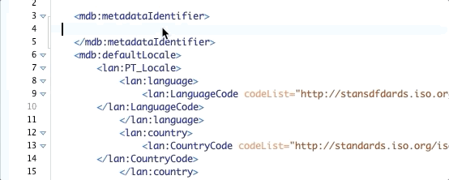

# Using Oxygen with ISO 19115-3

This repo will help you work with 19115-3 XML documents using Oxygen XML editor. Oxygen provides autocomplete of XML tags as well as schema validation making it much easier to create valid XML documents.

## Setup

1. [Download and install Oxygen XML editor](https://www.oxygenxml.com/xml_editor/download_oxygenxml_editor.html)
1. Clone this repo (`git clone https://github.com/cioos-siooc/cioos-oxygen-iso19115-howto` or "Code" -> "Download Zip" and unzip)
1. Unzip schema.zip
1. Open Oxygen. In the menu, go to "Oxygen XML Editor" -> "Preferences" -> "XML" -> "XML Catalog" . Click "Add" and find the catalog.xsd file that was extracted from the zip file. Press "OK"
1. In the menu go to "Document" -> "Schema" -> "Associate Schema". Browse to the file that was extracted from the zip - `schema/xsd/standards.iso.org/iso/19115/-3/mds/2.0/mds.xsd` and press "OK"
1. Now as you create and work with your XML document it will validate it against the 19115-3 schema.
